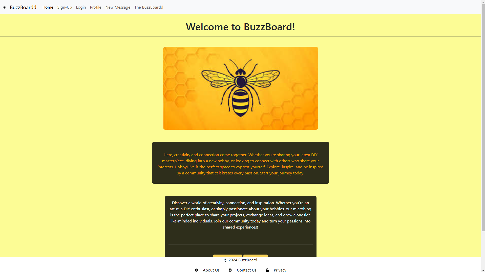
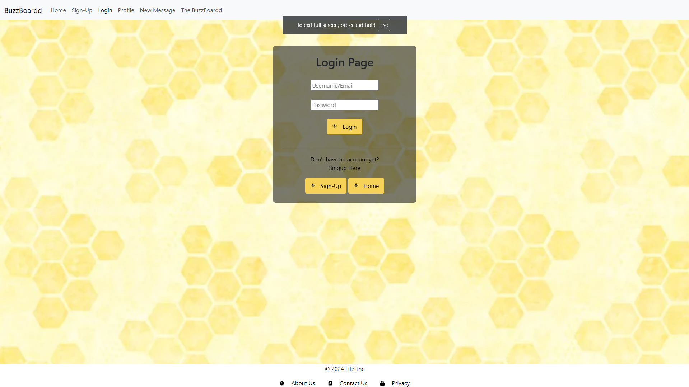
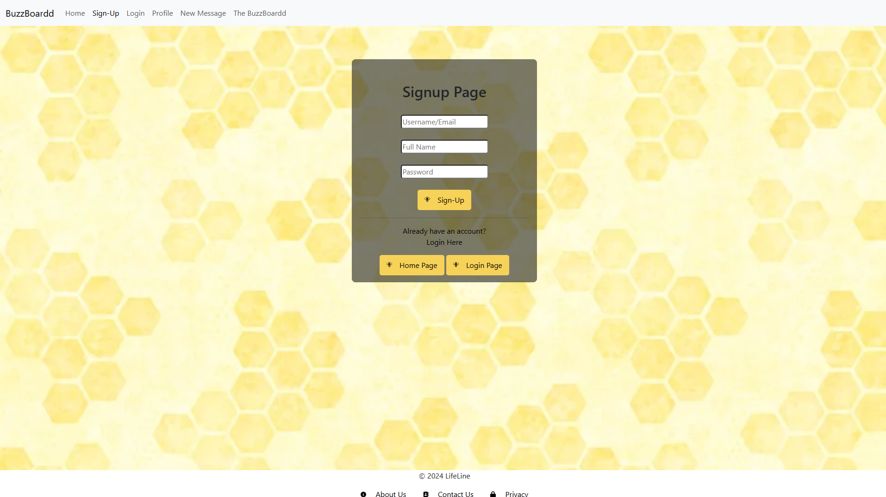
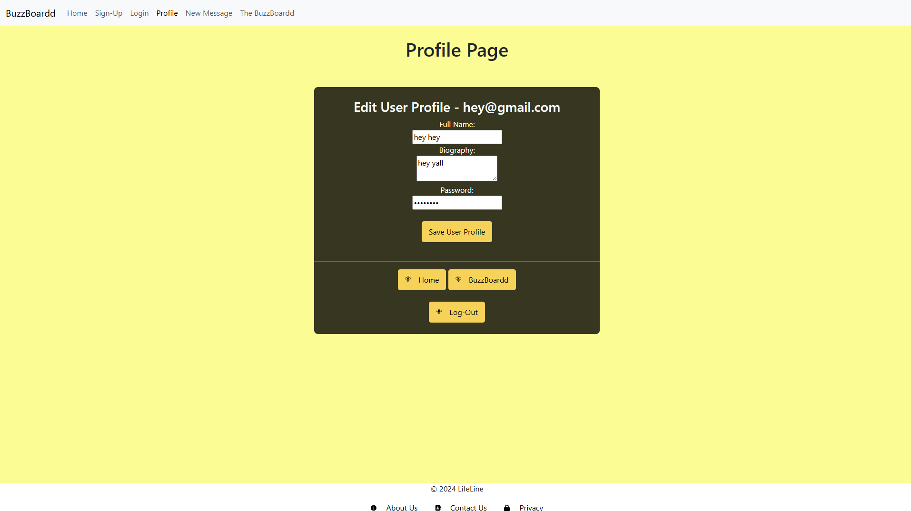
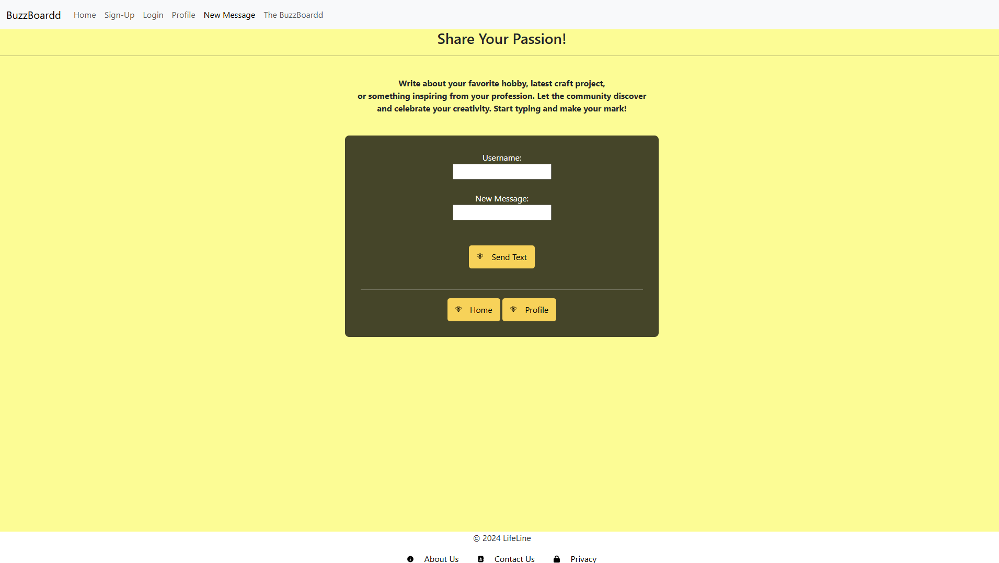
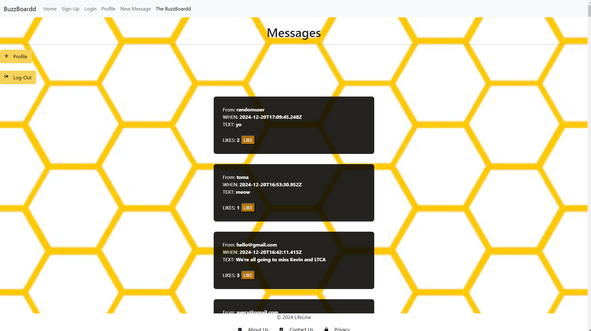

<h1> BuzzBoard </h1>
 
<h2><b>Synopsis</b> </h2>
 
 

Buzz Board is a vibrant blogging platform designed for hobby enthusiasts to share their passions, activities, and ideas. With features like a dedicated BuzzBoard message board, the ability to like and unlike posts, and easy-to-use login and signup pages, users can connect, interact, and inspire one another. Whether posting updates, exploring hobbies, or engaging with like-minded individuals, Buzz Board is the perfect space for creative expression and community connection.

<h2><b>Technologies used</b> </h2>
<li>HTML</li>
<li>CSS</li>
<li>BOOTSTRAP</li>
<li>JavaScript</li>
 
 

The homepage of Buzz Board serves as the welcoming gateway to an engaging blogging platform designed for hobby enthusiasts. Featuring a clean and vibrant design, it introduces users to the essence of Buzz Board—creativity, connection, and community. Visitors can learn about the platform’s mission, explore its benefits, and easily navigate to other pages, such as signing up, logging in, or viewing the message board. This page encourages users to dive into a world where hobbies and passions are celebrated, and connections are fostered.

<ul>Key Features
    <li>Navigation Bar for Seamless Browsing:

    The homepage includes a responsive navigation bar with links to essential pages like Sign-Up, Login, Profile, and the BuzzBoard, making it simple for users to access different sections of the website.</li>

    <li>Prominent buttons for "Sign-Up" and "Login" are strategically placed on the page, inviting users to join the community or log in to start sharing and connecting with others.</li>
</ul>

The Login Page of Buzz Board provides users with a straightforward and secure way to access their accounts. With a clean layout and intuitive design, it offers input fields for email or username and password, along with quick navigation options to redirect users to the Sign-Up page or homepage. The page ensures a seamless login experience, keeping users connected to the vibrant community of hobby enthusiasts.

<ul>Key Features
    <li>Simple and User-Friendly Login Form:

The login form includes clearly labeled fields for entering a username/email and password, ensuring an easy and efficient login process for all users.</li>
    <li>Quick Navigation Options:

Prominent links and buttons direct users to create an account if they don't have one or return to the homepage, enhancing usability and accessibility.</li>
</ul>

The Sign-Up Page of Buzz Board provides a seamless and user-friendly way for new users to create an account and join the community. Featuring a clean layout, it includes input fields for essential details like username/email, full name, and password. With clear navigation links, users can easily switch to the Login page if they already have an account or return to the homepage.

<ul>Key Features
    <li>Comprehensive Sign-Up Form:

The page includes clearly labeled fields for username/email, full name, and password, ensuring users can easily register and get started on the platform.</li>
    <li>Quick Access to Related Pages:

Prominent buttons and links allow users to navigate effortlessly to the Login page or return to the homepage, offering a smooth user experience.</li>
</ul>

The Profile Page of Buzz Board is designed to allow users to view and update their account information. It features fields for editing details like the full name, biography, and password. With easy navigation links, users can access other core sections of the platform, such as the homepage or the message board.

<ul>Key Features
<li>User Profile Editing:

    Users can edit their Full Name, update their Biography, and change their Password directly from this page. 
</li>
    
<li>Logout Option:
    
    A dedicated Log-Out button is available for security and convenience, allowing users to end their session.
</li>
</ul>

The New Text Page allows users to share their thoughts, projects, or inspiring stories with the Buzz Board community. It serves as a platform to promote creativity and self-expression, encouraging engagement among users.

<ul>Key Features
    <li>Footer Links:

    Additional links to About Us, Contact Us, and Privacy Policy pages ensure accessibility to critical site information.
</li>
    <li>Message Composition Area:
    Username Input:

     A dedicated field for users to enter their name or username before posting.
    Text Input Field: 
    A section where users can type their message, ensuring clarity and ease of use.
</li>
</ul>

The Messages Page, also referred to as "The BuzzBoardd," is a centralized hub where users can view shared posts, fostering engagement and interaction within the BuzzBoard community. It acts as a lively space where individuals can share ideas, hobbies, and inspiring stories, promoting creativity and collaboration. The page is designed to be user-friendly, ensuring a seamless experience for both contributors and readers alike.

<ul>Key Features
    <li>Navbar: 

    Quick links to Home, Sign-Up, Login, Profile, New Message, and the active Messages Page, providing seamless navigation across the site.
    Profile Button: 

    Users can conveniently access their profile page to manage their personal information or make edits.
</li>
    <li>Community-Centric Design:

    A welcoming "Messages" heading with a clean interface makes it easy for users to browse and interact with the community's content.
</li>
</ul>

